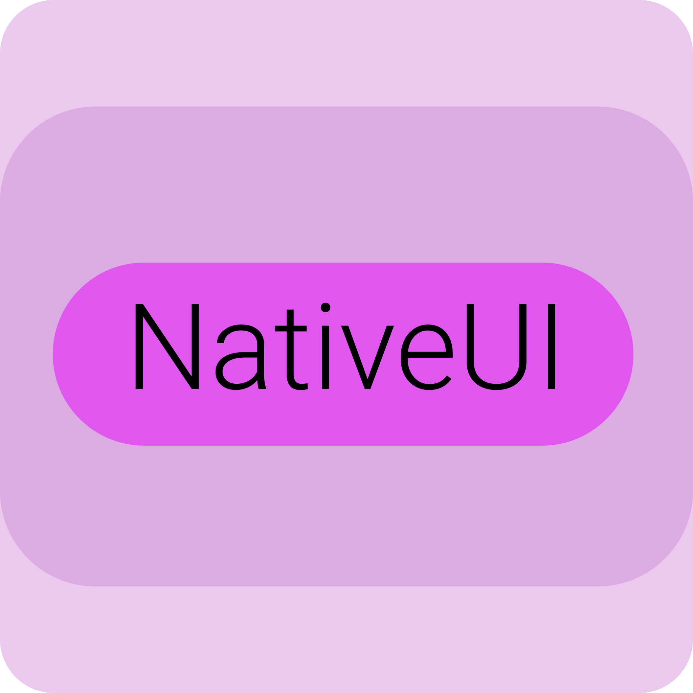

# NativeUI
<p align="center">


Wip oop based ui framework written in cpp with raylib and cpp-bindings. Using [this very awesome cpp template](https://github.com/CapsCollective/raylib-cpp-starter)
</p>

## Getting Started

### Installing Dependencies

Before building the project, you will need to install all relevant dependencies for your platform so that the project has access to all the tools required, and raylib can compile and link correctly. You can find intructions for installing dependencies on macOS, Linux, and Windows in the [docs file on installing dependencies](docs/InstallingDependencies.md).

### Building the Project
Once you have cloned this repository and installed dependencies, building the project is as simple as running these two commands in its root directory:

#### macOS & Linux
```console
$ make setup
$ make
```

#### Windows
```console
> mingw32-make setup
> mingw32-make
```

The first command will clone in the lastest C++ bindings and targeted version of raylib, copy across any relevant header files into `/includes`, and build a static library file from them, placing it in `/lib`. The second command then compiles, runs and cleans up your project.

### Draw.io
You can also take a look at `./ui.drawio`, representing class diagram.

### Making Use of Separate Compilation
When building compiled applications from scratch, *each* source file needs to be compiled into an object file in order for them all to be linked together as a full program. This can become rather time-consuming and inefficient as your codebase expands to use tens or even hundreds of files that recompile each time you build. Fortunately, with a few clever rules in our [`Makefile`](Makefile), we can be sure to only have to recompile files affected by our changes.

By using the following Make commands instead of the default target, we can skip the cleanup step, and only recompile files that changed:

#### macOS & Linux

```console
$ make bin/app; make execute
```

#### Windows

```console
> mingw32-make bin/app && mingw32-make execute
```

## Licence

This project is licenced under an unmodified zlib/libpng licence, which is an OSI-certified, BSD-like licence that allows static linking with closed source software. Check [`LICENCE`](LICENCE) for further details.
